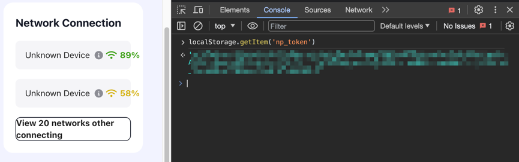
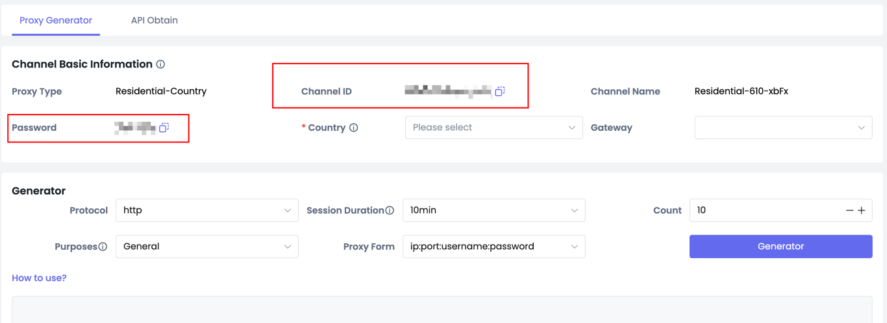

# nodepay Multi-device BOT

## Links

Nodepay: [Registration Nodepay](https://app.nodepay.ai/register?ref=J09N5r3QxU6O99f)

NSTProxy: [Buy Proxy](https://app.nstproxy.com/register?i=wjgSmA&utm_source=github&utm_medium=referral) $1.8/GB 10% discount code `HENRYDUNPHYS`

Telegram: [Join Telegram](https://t.me/web3airdropclub)

Server Rental: [Buy Server](https://www.vultr.com/?ref=9152112)


## Get NP_TOKEN

Open the link and log in https://app.nodepay.ai/dashboard

Press F12 on the page to open the console

Write localStorage.getItem('np_token');



## Get Proxy

NSTProxy: [Buy Proxy](https://app.nstproxy.com/register?i=wjgSmA&utm_source=github&utm_medium=referral)

Get channelId and channel password.




## Run
Fill in the parameters you have obtained.
```
NP_TOKEN = ""
channelId = ""
password = ""
countryList = ["ANY"]
taskNum = 200
```